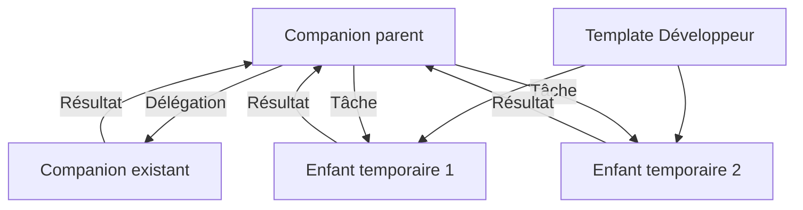

# companions.build — vision et cadrage produit

Mis à jour le **6 septembre 2026**.

Ce document rassemble les décisions de Stan et les fonctionnalités discutées pour **un nouveau
projet**, companions.build. Il constitue la référence produit pour poursuivre le cadrage. Il ne
décrit pas le fonctionnement du dépôt Companion actuel et ne vaut pas encore spécification
d'implémentation complète. Les propositions et questions non tranchées sont signalées.

Ce cadrage conserve les décisions approuvées, y compris leurs formulations historiques. Pour ne
pas confondre décision et livraison, l'état vérifié du dépôt et l'audit des écarts sont maintenus
dans [v0.md](v0.md). Une fonctionnalité décrite ici n'est pas réputée terminée par sa seule présence
dans ce document.

## 1. Vision

Construire un « Grok bot » open source : des collaborateurs IA faciles à créer, chacun avec un
ordinateur persistant, des outils, des skills et des automatismes. Ils peuvent travailler seuls,
se déléguer des tâches et lancer des exécutants temporaires spécialisés.

Le produit est **web uniquement**, avec une interface très pure et simple. L'utilisateur parle
à son Companion, suit son travail et peut ouvrir son bureau pour intervenir. Toute configuration
est également réalisable par l'agent via un MCP de contrôle companions.build.

Le projet repart de zéro. L'ancien code fournit des apprentissages et des cas de panne à tester ;
son architecture, ses migrations et ses anciennes générations ne sont pas le point de départ.
L'historique de companion-v2 n'est pas un préalable à la construction.

Les problèmes à résoudre en priorité sont concrets : création trop lente, machines qui ne se
réveillent pas, routines qui ne démarrent pas, systèmes qui s'arrêtent et travaux qui restent
bloqués. La rapidité et la fiabilité font partie du produit dès sa première version.

## 2. Décisions structurantes confirmées

| Sujet | Décision |
| --- | --- |
| Nouveau départ | Nouveau projet open source, indépendant de l'architecture actuelle |
| Développement | Projet principalement vibe codé ; la facilité à comprendre et maintenir le code compte dans le choix technique |
| Validation | Tester un maximum en local, reproduire les incidents et donner aux agents de développement une boucle de diagnostic et de validation autonome |
| Client | Application web uniquement, design minimal |
| Ordinateurs | box.ascii.dev conservé |
| Moteur et distribution | Pi SDK embarqué dans notre programme Companion, avec Bun pour une distribution autonome ; packaging Linux à éprouver |
| Démarrage | Runtime figé, préinstallé, démarrage automatique ; pas d'installation de ses dépendances ni de mise à jour au réveil |
| Conversation | Un seul chat actif par Companion, avec continuité de l'historique ; messages pendant le travail et interruption suivent le comportement natif de Pi |
| Travail en arrière-plan | File commune aux routines, triggers et délégations reçues ; une tâche en exécution par Companion, chat indépendant ; une tâche en attente humaine libère la place |
| Intervention humaine | Carte Besoin de toi rattachée à la tâche, réponse transmise à cette tâche ; un enfant demande d'abord les précisions à son parent |
| Rattrapage des routines | Après indisponibilité, seule la dernière occurrence manquée de chaque routine est rattrapée ; les précédentes sont marquées manquées |
| Résultats automatiques | La tâche décide de publier ou non dans le chat principal ; son exécution et son résultat restent consultables dans l'activité |
| Fichiers des enfants | Les fichiers remis comme résultats survivent à l'enfant et restent attachés à sa tâche ; les autres disparaissent avec sa Box sauf conservation dans un template |
| Pièces jointes | Ajout au chat par bouton ou glisser-déposer ; fichiers produits accessibles depuis la conversation ou la tâche |
| Mémoire et contexte | Mémoire commune au chat et aux routines d'un Companion, historiques d'exécution séparés ; un enfant reçoit un brief préparé par son parent |
| Gestion de la mémoire | Gérée par le Companion ; pas de surface utilisateur de consultation ou d'édition manuelle de la mémoire |
| Skills | Installation demandée dans le chat depuis un dépôt ou des fichiers fournis, réalisée et vérifiée par l'agent ; aucune intégration au Skills Hub |
| Plugins | Reprendre les plugins existants et leur comportement ; GitHub, Sentry, Linear, Notion et Conductor explicitement cités pour le lancement |
| Collaboration | Communication et délégation entre Companions |
| Réplicats | Seuls les Companions permanents lancent des enfants temporaires depuis un template autorisé ; un enfant demande du renfort à son parent, sans créer ses propres enfants |
| Amélioration | Le parent peut choisir la Box d'un enfant comme prochain template |
| Comptes des templates | Un template privé peut transmettre volontairement ses sessions navigateur aux propres agents de l'utilisateur ; un template livré à un client est préparé sans les comptes personnels du prestataire |
| Triggers | Déclenchement direct ou filtre en code pouvant consulter des API autorisées, sans LLM ni réveil du Companion pour le filtrage ; événements liés au même problème regroupés |
| Webhooks génériques | Disponibles en complément des plugins ; filtres sans stockage persistant propre dans la première version |
| Bureau | Ouvrir réveille la Box si nécessaire ; Prendre la main suspend les interactions avec le bureau jusqu'à Rendre la main, même après fermeture du navigateur |
| Configuration | Toutes les fonctionnalités configurables sont accessibles à l'agent par MCP |
| Utilisateurs | Comptes personnels indépendants, chacun avec ses Companions et connexions ; accès de maintenance explicitement accordés |
| Livraison client | Copies indépendantes du Companion et de ses templates de spécialistes nécessaires, activées avec l'abonnement du client ; maintenance facultative acceptée et révocable |
| Offre hébergée | Abonnement companions.build avec facturation à l'usage ; le client ne paie pas directement Box et les modèles |

Stan a retenu **Pi/Bun** après la comparaison des harnesses : notre programme Companion embarque
Pi SDK et vise une distribution autonome facilement installable. Le choix est validé ; sa
compilation avec les ressources et outils requis, ainsi que ses performances sur Linux/Box,
ont une première preuve locale documentée en section 13. Les performances et le
cycle de vie chez Box restent à vérifier.

## 3. Vocabulaire

**Companion** : collaborateur IA persistant, avec une identité, une mission, un ordinateur, une
mémoire et un chat. Il peut recevoir du travail humain ou automatisé.

**Tâche** : travail confié à un agent, avec un état et un résultat. Elle peut venir du chat,
d'une routine, d'un trigger ou d'une délégation.

**Mémoire du Companion** : informations et préférences conservées pour ses travaux futurs,
communes à son chat et à ses routines. Elle se distingue de l'historique des conversations.

**Brief de délégation** : objectif, contraintes et références que le parent transmet à un
enfant pour accomplir une tâche.

**Routine** : consigne exécutée selon un calendrier. Chaque occurrence produit une exécution
distincte dont le résultat reste consultable.

**Trigger** : règle qui transforme un événement externe reçu par webhook en tâche, directement
ou après validation par un filtre en code.

**Délégation** : tâche qu'un agent confie à un autre agent autorisé, avec un résultat destiné au
demandeur. Le destinataire peut être un Companion existant ou un réplicat.

**Template d'agent** : point de départ réutilisable d'un agent spécialisé, comprenant son profil
et son environnement logiciel préparé. Il peut évoluer à partir de la Box d'un enfant.

**Profil d'agent** : partie du template qui décrit le spécialiste : instructions, skills, modèle
et outils prévus. Cette distinction explique le template ; elle ne nécessite pas un écran séparé.

**Réplicat**, ou **enfant** : exécutant temporaire créé depuis un template pour une tâche. Il
disparaît après son travail ; ses résultats et les améliorations retenues peuvent lui survivre.

**Parent** : agent qui a lancé un réplicat et reçoit son résultat. Le parent peut décider de
conserver sa Box comme nouveau template lorsqu'il y est autorisé.

**Connexion** : accès à un compte externe utilisé par le Companion. Une connexion dans le
navigateur et une connexion MCP/API donnent des capacités différentes.

**Plugin** : intégration présentée dans le produit, pouvant fournir des outils MCP et des sources
de triggers. Le détail du format des plugins reste à définir.

**MCP de contrôle** : interface qui permet à l'agent de configurer et piloter companions.build,
en complément des MCP fournisseurs qui donnent accès aux outils externes.

## 4. Créer et utiliser un Companion

L'utilisateur crée un Companion vierge ou part d'un template. Il lui donne un nom, une mission,
des instructions et les outils nécessaires. Il peut installer des skills directement, sans
devoir passer par une bibliothèque, un système de publication ou un catalogue Skills Hub.

La création ouvre son chat et affiche l'avancement réel du démarrage. Le travail accepté doit
rester visible même si la machine n'est pas encore disponible. L'utilisateur peut fermer le
navigateur et retrouver ensuite l'historique, les tâches et leurs résultats.

La configuration peut se faire dans le chat ou depuis la fiche du Companion. Ces deux surfaces
consultent et modifient les mêmes réglages. L'agent peut vérifier ses accès et indiquer ce qui
lui manque pour accomplir sa mission.

Les résultats comprennent messages, fichiers et liens utiles, par exemple vers une correction
préparée. Les fichiers remis comme résultats sont attachés à leur tâche et peuvent être transmis
dans le chat, sans bibliothèque de fichiers supplémentaire.

**Parcours retenu pour les fichiers :** l'utilisateur ajoute des pièces jointes au chat par un
bouton ou par glisser-déposer. Les fichiers produits sont accessibles depuis la conversation ou
la tâche correspondante. Le stockage et le transfert concrets restent à concevoir.

**Parcours retenu pour les skills :** l'utilisateur demande dans le chat une installation depuis
un dépôt ou des fichiers fournis. L'agent réalise l'installation et vérifie que le skill est
utilisable avant de l'annoncer comme installé. Ce parcours s'applique aux Companions et aux
environnements préparés pour leurs templates, sans catalogue Skills Hub supplémentaire.

### Intégrations au lancement

**Décision de Stan : reprendre les plugins existants et le même comportement.** GitHub, Sentry,
Linear, Notion et Conductor ont été explicitement cités pour le lancement. Le catalogue actuel
fait référence pour le périmètre existant ; il comprend aussi Slack et Gmail. L'ajout de MCP
personnalisés, déjà présent, fait partie du comportement de référence.

Conserver notamment :

- La connexion des comptes, leurs libellés et la possibilité de connecter plusieurs comptes
  d'un fournisseur ; OAuth et renouvellement selon les intégrations existantes.
- La distinction entre connecter un compte et sélectionner les outils MCP accessibles à un
  Companion. Détacher ces outils d'un Companion ne déconnecte pas le compte.
- Les capacités existantes de GitHub, Linear, Notion et Sentry, ainsi que leurs parcours de
  triggers là où ils sont déjà pris en charge. Un plugin MCP ne fournit pas automatiquement
  un adaptateur de webhook pour tous les événements de son fournisseur.
- Le plugin **Conductor `build.conductor/mcp`**, connecté à `https://api.conductor.build/mcp` :
  OAuth, accès aux workspaces/sessions/agents exposés par ce MCP et liens d'ouverture de workspace.
  Son identification est résolue par le code existant.
- Les MCP personnalisés distants HTTP ou locaux stdio, avec leurs paramètres et credentials.
- Les limites fonctionnelles existantes : par exemple Gmail lit/recherche et prépare des
  brouillons, sans envoi d'email ; Slack utilise son compte Bot User pour les messages autorisés.
- Des credentials chiffrés et non relus en clair, ainsi que la déconnexion et la révocation des accès.

Les nouveaux filtres et regroupements de triggers s'ajoutent à ce socle selon les décisions de
la section 6. La configuration reste pilotable par le MCP companions.build. La reprise porte
sur les comportements et les contrats utiles, en les adaptant au modèle de comptes du nouveau
produit ; elle n'impose ni de copier les modules du runtime historique, ni de migrer les comptes
et credentials existants. L'interface conserve la direction web minimale choisie.

Référence locale vérifiée : [catalogue](https://github.com/The-Vibe-Company/companion/blob/8d000e5a1ff3d3d068c8e67b065b78b4a9f9c2e9/packages/contracts/src/companionPluginCatalog.ts),
[OAuth et limites fournisseurs](https://github.com/The-Vibe-Company/companion/blob/8d000e5a1ff3d3d068c8e67b065b78b4a9f9c2e9/packages/core/src/companionPluginOAuth.ts),
[comptes et MCP personnalisés](https://github.com/The-Vibe-Company/companion/blob/8d000e5a1ff3d3d068c8e67b065b78b4a9f9c2e9/apps/web/src/components/companions/CompanionPlugins.tsx),
[sélection par Companion](https://github.com/The-Vibe-Company/companion/blob/8d000e5a1ff3d3d068c8e67b065b78b4a9f9c2e9/apps/web/src/components/companions/CompanionPluginPicker.tsx) et
[accès complémentaires aux triggers](https://github.com/The-Vibe-Company/companion/blob/8d000e5a1ff3d3d068c8e67b065b78b4a9f9c2e9/packages/core/src/companionPluginTriggerKeys.ts).
Les tests associés servent de cas de comportement à reprendre ; cette lecture ne constitue
pas un essai des services distants ni une promesse sur leurs futures évolutions.

### Messages pendant le travail

**Décision de Stan : suivre le comportement natif de Pi, sans réinventer cette interaction.**
L'intégration web expose les mécanismes de message pendant le travail et d'interruption de la
version Pi retenue. Elle ne crée pas un deuxième moteur de steering ou une politique de file
de conversation concurrente à celle du SDK. Le bouton Arrêter utilise son mécanisme d'annulation.
La persistance de l'envoi et de son résultat reste une responsabilité du produit.

### Démarrage rapide

L'objectif exprimé est un agent prêt en quelques secondes, contre parfois une minute auparavant.
La cible discutée pour le prototype est **moins de deux secondes pour accepter une tâche après
le lancement du programme sur une Box déjà disponible**. Le temps complet de création ou de réveil
doit également être mesuré ; il inclut le fournisseur et n'est pas encore démontré.

Trois mesures doivent rester distinctes : machine disponible, agent prêt à accepter le travail,
puis première réponse du modèle.

Le runtime est livré dans une version complète et connue, déjà présente dans le template Box.
La cible retenue est un programme Pi/Bun autonome facilement installable ; son packaging et les
ressources nécessaires restent à éprouver sur Linux. Installer un outil nécessaire à une tâche
demeure possible ; cela ne remet pas en cause l'absence de réinstallation du runtime au démarrage.

Box conserve l'identité et les fichiers lors d'une reprise, mais redémarre les processus sur une
nouvelle machine. Le produit doit traiter ce redémarrage comme un fonctionnement normal.
[Persistance Box](https://docs.ascii.dev/box/snapshots).

## 5. Routines et travail en arrière-plan

Exemple : « Chaque matin, prépare un point sur les bugs ouverts. »

L'agent peut créer, modifier, activer, désactiver et supprimer la routine via le MCP de contrôle.
La fiche affiche sa consigne, son calendrier, sa prochaine exécution et son dernier résultat.

Le chat utilise une session persistante. Une routine utilise une session distincte avec son
propre historique. **Une routine ne fait pas attendre la réponse au chat.** Routines, triggers
et nouvelles délégations reçues partagent une file de travail en arrière-plan : une seule de
ces tâches est en exécution par Companion, les suivantes attendent dans l'ordre d'arrivée. Une
tâche suspendue pour une réponse humaine libère cette place, selon le contrat ci-dessous. Les enfants
peuvent travailler en parallèle sur leurs propres Boxes. Les précisions et réponses liées à
une tâche déjà en cours suivent le contrat de délégation ci-dessous.

**Contexte retenu :** chat et routines partagent la mémoire du Companion. Chaque exécution de
routine reçoit sa consigne, les instructions du Companion et les informations mémorisées ; elle
garde son propre historique. Elle peut rechercher une ancienne conversation si nécessaire,
sans recevoir automatiquement l'intégralité du chat. Une préférence mémorisée s'applique aux
travaux futurs ; une phrase passagère ne devient pas automatiquement une instruction permanente.

L'ordonnancement doit fonctionner même lorsque la Box dort, afin de pouvoir déclencher son réveil.
Une Box simplement endormie relève de ce parcours normal et ne constitue pas une occurrence
manquée à elle seule.

**Rattrapage retenu :** après une indisponibilité de la plateforme, seule la dernière occurrence
manquée de chaque routine est mise en file pour exécution. Son retard est indiqué ; les précédentes
sont marquées manquées et ne sont pas rejouées. Les tâches déjà acceptées avant la panne gardent
leur identité et leur état ; le rattrapage ne doit pas les recréer.

**Gestion de la mémoire :** Stan ne souhaite pas de gestion manuelle côté utilisateur. La
mémoire reste gérée par le Companion ; aucune rubrique de consultation, correction ou suppression
des informations mémorisées n'est prévue dans l'interface. Les calendriers détaillés et les
mécanismes internes de lecture et de mise à jour de la mémoire restent à préciser.

### Une tâche a besoin de l'utilisateur

**Comportement retenu :** une carte **Besoin de toi** apparaît dans le chat et désigne la tâche
qui pose la question. La réponse est transmise directement à cette tâche. Un enfant demande
d'abord les précisions à son parent ; celui-ci peut solliciter l'utilisateur si nécessaire.

Pendant l'attente humaine, la tâche est suspendue et libère la place pour les autres tâches
en arrière-plan. Le chat reste disponible. La réponse ne lance pas une nouvelle tâche sans lien :
elle permet la reprise de la tâche suspendue, en respectant la limite d'une tâche en exécution.
L'ordre exact de reprise par rapport à la file et la suspension durable du moteur restent à concevoir.

La question, son rattachement et sa réponse doivent survivre à une reconnexion ou à un
redémarrage. Le choix de rester silencieux sur le résultat final ne masque pas une demande
d'intervention nécessaire à la tâche. La carte n'interrompt pas la réponse de chat en cours.

### Publication dans le chat principal

**Décision de Stan : une routine ou une tâche déclenchée par webhook peut décider de publier
une information dans le chat principal ou de rester silencieuse.** La publication n'est pas une
conséquence automatique de la fin de chaque tâche.

Lorsqu'elle publie, une entrée compacte indique l'origine, le résumé et le résultat, avec des
détails consultables. Ce contenu est produit pendant la tâche ; son affichage ne nécessite pas
un nouvel appel au modèle et n'interrompt pas la conversation en cours.

Exemple : une vérification quotidienne peut rester silencieuse si rien ne demande d'attention,
et publier lorsqu'elle détecte un problème utile à signaler. Les instructions de la tâche
peuvent préciser ce qui mérite une publication.

La décision de publier concerne le message dans le chat. L'exécution conserve son état, son
résultat ou son échec dans l'activité, même sans publication. Une tâche interrompue avant de
choisir reste donc observable. Le mécanisme précis permettant à la tâche d'exprimer ce choix
reste à définir dans le contrat d'exécution.

## 6. Triggers : réagir aux webhooks sans gaspiller des appels LLM

Cas demandés : une CI échoue sur la branche main d'un projet ; une nouvelle issue apparaît dans
Sentry. Chaque trigger désigne une source, un Companion cible et la consigne à exécuter.

Deux modes sont prévus :

- **Direct** : un événement valide correspondant à la source configurée crée une tâche.
- **Filtré par code** : une fonction examine l'événement ; seule son acceptation crée une tâche.

Le filtre s'exécute avant tout appel au modèle et avant le réveil de la Box du Companion.
Un événement ignoré n'a pas besoin d'un agent pour être évalué.
Le Companion peut aider à écrire le filtre lors de sa configuration ; l'évaluation de chaque
webhook exécute uniquement le code enregistré.

**Accès externe retenu :** le filtre peut consulter une API lorsque sa décision nécessite une
information supplémentaire, avec les connexions autorisées. Exemple : vérifier qu'une issue
n'est pas déjà traitée. Les filtres simples examinent seulement le payload. Ces consultations
s'exécutent dans l'environnement du filtre, sans LLM ni réveil de la Box du Companion.

**État du filtre :** dans la première version, le filtre ne possède pas de stockage persistant
propre entre événements. Il examine l'événement et peut consulter les API autorisées. La
déduplication, le regroupement et le suivi des livraisons restent persistés par companions.build.

Exemple de filtre pour une source GitHub `workflow_run` limitée au dépôt choisi :

```js
function shouldTrigger(payload) {
  return payload.action === "completed"
    && payload.workflow_run?.head_branch === "main"
    && payload.workflow_run?.conclusion === "failure";
}
```

Consigne associée : « Analyse cet échec de CI et prépare une correction. » GitHub livre aussi
les exécutions réussies ; la conclusion fait donc partie du filtre.
[Événements GitHub](https://docs.github.com/en/webhooks/webhook-events-and-payloads#workflow_run).

Pour Sentry, une nouvelle issue correspond à un événement distinct d'une nouvelle occurrence
sur une issue déjà connue. Les champs du filtre dépendent du payload effectivement reçu.
[Webhooks d'issues Sentry](https://docs.sentry.io/integrations/integration-platform/webhooks/issues/).

L'expérience proposée comprend un bouton **Tester sur un événement**, avec trois résultats :
déclencher, ignorer ou erreur. Un test de filtre ne lance pas réellement le Companion. Les
livraisons et leur décision sont consultables pour comprendre pourquoi un trigger a réagi.

Les intégrations gérées prennent en charge l'enregistrement du webhook avec les credentials
disponibles. **Un webhook générique est également prévu**, avec les mêmes modes direct et filtré
par code, pour les services absents des plugins. L'agent configure la source automatiquement
lorsqu'il dispose des accès nécessaires ; la réception générique ne suppose pas un nouveau plugin.
Authentification et déduplication s'appliquent aussi au mode direct. Un filtre en erreur ne
déclenche pas par défaut. Son langage, les modalités d'accès aux connexions et son environnement
d'exécution isolé restent à choisir.

### Événements multiples pour le même problème

**Regroupement retenu :** lorsque plusieurs événements acceptés concernent le même problème
identifiable, ils sont regroupés. Une tâche encore en attente est enrichie avec les nouveaux
événements. Si une analyse tourne déjà, une seule tâche de suivi au maximum reste en attente
pour ce problème et reçoit les événements supplémentaires. Elle passe par la file commune du
Companion. Un regroupement ne modifie pas silencieusement les données de l'analyse en cours.

Les livraisons strictement identiques sont dédupliquées et ne créent aucun travail supplémentaire.
Cette déduplication se distingue du regroupement d'événements différents, par exemple plusieurs
événements pour une même issue Sentry. Un événement rejeté par le filtre ne devient pas une tâche
de suivi. L'identification du problème doit rester explicite et ne nécessite pas de LLM ; sa
configuration précise par intégration reste à définir. Sans identité commune établie, des
problèmes distincts ne sont pas fusionnés arbitrairement.

## 7. Companions qui collaborent et réplicats spécialisés

Un Companion peut parler à un autre Companion et lui déléguer du travail. Il peut aussi recevoir
l'autorisation de lancer des réplicats d'un template spécialisé, jusqu'à un maximum configuré.

**Création d'enfants retenue :** seuls les Companions permanents peuvent lancer des réplicats.
Un enfant ne crée pas ses propres enfants. Il peut demander du renfort à son parent ; celui-ci
décide de lancer un autre spécialiste parmi ses templates autorisés. Cette règle garde les
exécutants rattachés au parent qui porte la tâche.

Exemple : un Companion Responsable technique dispose d'un template Développeur et peut demander
une revue à un Companion Relecteur existant. Il répartit des corrections entre des développeurs
temporaires, récupère leurs résultats puis les transmet au Relecteur.



Les enfants disparaissent après leur tâche. Leur résultat doit être récupéré avant cette
suppression. L'affichage proposé les rattache à l'activité du parent, avec un détail consultable,
sans les ajouter à la liste des Companions permanents.

**Fichiers conservés :** les fichiers que l'enfant remet comme résultats — patch, rapport,
image, document — sont conservés avec sa tâche avant la suppression de sa Box. Le parent peut
les récupérer et les transmettre dans le chat. Les autres fichiers restent dans la Box et
disparaissent avec elle, sauf si le parent conserve son environnement comme template. La
confirmation de conservation des résultats fait partie de la fin de tâche ; un simple chemin
vers un fichier de la Box supprimée ne suffit pas.

**Contexte retenu pour un enfant :** le parent prépare un brief avec objectif, contraintes,
fichiers et références utiles. L'enfant dispose aussi des instructions, skills et logiciels de
son template. Il peut demander des précisions au parent, puis lui retourne son résultat. Son
historique reste séparé ; il ne reçoit pas automatiquement toute la conversation du parent.
Le parent décide quels apprentissages conserver dans sa mémoire et peut promouvoir la Box
selon le parcours défini ci-dessous.

**Délégation à un Companion permanent :** une nouvelle tâche rejoint sa file de travail en
arrière-plan, commune aux routines et triggers. Son chat reste disponible. Une demande de
précision ou une réponse liée à une tâche en cours rejoint directement cette tâche ; elle ne
doit pas attendre derrière celle qui attend sa réponse. Ce message reste identifié et persistant,
sans devenir une deuxième tâche indépendante. Les détails de livraison au moteur restent à définir.

Le parent suit le travail confié et restitue les résultats. Le mécanisme de transfert des fichiers
et le traitement des cycles de nouvelles délégations entre Companions permanents restent à
concevoir. L'absence de réplication récursive ne résout pas à elle seule une attente circulaire
entre deux Companions permanents. Les plafonds détaillés sont différés dans la discussion.

## 8. Utiliser la Box d'un enfant comme prochain template

Le parent peut choisir l'environnement d'un enfant qui a bien fonctionné pour les lancements
suivants. Exemple : l'enfant a installé un logiciel utile ; le parent décide de conserver sa Box.

Le parcours retenu est la **capture directe de la Box**, plutôt que la reconstruction de ses
installations à partir d'une recette :

1. L'enfant termine sa tâche et transmet son résultat.
2. Le parent décide d'utiliser sa Box comme prochain template.
3. La plateforme capture l'environnement dans un nouveau template.
4. Les prochains enfants démarrent depuis cette version préparée.
5. La Box temporaire peut être supprimée lorsque la capture est confirmée.

Box permet au template de survivre indépendamment de la machine source.
[Templates Box](https://docs.ascii.dev/box/snapshots#template-boxes).

Cette capacité conduit à prévoir une Box dédiée par enfant promouvable. Les enfants déjà actifs
gardent leur environnement ; la nouvelle version concerne les suivants. Conserver la version
précédente et valider un lancement avant publication sont les protections proposées pour la reprise.

**Comptes connectés :** un template privé destiné aux propres agents de l'utilisateur peut
conserver et transmettre ses sessions navigateur lorsque cet accès est volontairement inclus.
Un template destiné à un client est préparé sans les comptes personnels du prestataire ; les
comptes du client sont connectés ensuite. Ce parcours ne suppose pas qu'un snapshot puisse
identifier ou nettoyer automatiquement tous les secrets écrits sur disque.

Chaque enfant reçoit une identité d'exécution propre. La conservation d'un compte navigateur
n'autorise pas le clonage de l'identité du précédent enfant ni de ses credentials techniques
d'exécution. Le traitement précis de ces credentials, l'isolation des historiques et les
promotions concurrentes restent à concevoir. Le droit de modifier un template est proposé
comme distinct du droit de lancer des enfants depuis celui-ci.

## 9. Bureau interactif

L'utilisateur peut ouvrir et manipuler le bureau réel de la Box : souris, clavier, navigateur
et applications. Il peut installer des logiciels, connecter des comptes ou effectuer une étape
manuelle, puis laisser le Companion poursuivre.

**Parcours retenu :**

- **Ouvrir le bureau** depuis le chat réveille la Box si nécessaire et permet d'observer.
- **Prendre la main** suspend les interactions des agents avec ce bureau, puis indique que
  l'utilisateur peut intervenir. L'interface n'annonce pas la main disponible avant la suspension.
- **Rendre la main**, depuis le bureau ou la fiche du Companion, permet aux agents de reprendre
  leurs interactions avec le bureau.

Le chat et les travaux n'utilisant pas le bureau peuvent continuer. Cette coordination concerne
toutes les sessions qui utilisent le même bureau. Son mécanisme technique, la gestion d'une
action déjà engagée et sa persistance restent à concevoir.

**Déconnexion humaine :** fermer le navigateur, quitter l'onglet du bureau ou perdre la
connexion ne rend pas la main automatiquement. Les interactions des agents avec le bureau
restent en pause jusqu'à l'action explicite Rendre la main. Le chat et les travaux qui n'utilisent
pas le bureau continuent ; l'utilisateur peut rendre la main depuis la fiche sans rouvrir le bureau.

Box fournit le bureau interactif. Son mode VNC nécessite une page de premier niveau pour
l'authentification : un onglet dédié est donc proposé pour le premier parcours. Le bureau se
prépare à la demande pour ne pas retarder le démarrage de l'agent.
[Bureau Box](https://docs.ascii.dev/box/desktop-streaming).

Une connexion effectuée dans le navigateur reste une session navigateur ; elle ne crée pas
automatiquement un accès MCP/API au même fournisseur.

## 10. Toute la configuration passe aussi par le MCP de contrôle

**Une fonctionnalité configurable n'est complète que lorsqu'elle est pilotable par l'agent via
le MCP companions.build.** Le chat et l'interface web utilisent la même configuration et les
mêmes opérations métier.

| Domaine | Capacités attendues du MCP |
| --- | --- |
| Companions | Créer, lire et modifier mission, instructions, modèle et configuration ; piloter les actions de cycle de vie autorisées |
| Skills | Lister, installer, modifier et retirer |
| Plugins et connexions | Découvrir, connecter, vérifier, associer et retirer les accès autorisés |
| Routines | Créer, modifier, activer, désactiver, supprimer, tester et consulter les exécutions |
| Triggers | Configurer source et consigne, écrire le filtre, tester, activer/désactiver et consulter les décisions |
| Délégation | Découvrir les agents autorisés, confier une tâche, suivre, récupérer le résultat et demander l'annulation |
| Réplicats | Lancer depuis un template autorisé, suivre et arrêter |
| Templates | Configurer, capturer une Box enfant, suivre la préparation, sélectionner une version et revenir à une version précédente |
| Bureau | Demander l'ouverture et organiser une intervention humaine |
| Livraison client | Préparer une copie indépendante, suivre son activation et gérer la maintenance dans les accès accordés par le client |
| Vérification | Lire les réglages effectifs, les capacités disponibles et l'issue des opérations |

Exemple de demande : « Quand la CI échoue sur main, analyse-la et utilise le template Développeur
pour préparer une correction. » L'agent vérifie les connexions, configure et teste le trigger,
puis prépare les délégations qu'il est autorisé à gérer.

Le MCP respecte les permissions accordées au Companion. Une configuration peut commencer dans
le chat, demander un consentement OAuth ou une intervention dans le bureau, puis reprendre après
cette étape humaine. Le produit réalise automatiquement ce qu'il peut faire avec les accès déjà
disponibles. Les identifiants de paiement et consentements requis ne sont pas inventés par l'agent.

Les opérations longues sont suivies jusqu'à leur résultat. L'agent doit pouvoir vérifier qu'un
réglage est appliqué avant de l'annoncer comme terminé. Le contrôle souris/clavier lui-même dépend
des outils présents sur Box ; le MCP produit organise l'accès et la configuration.

## 11. Livrer un Companion à un client

Le cas d'usage confirmé est de préparer un Companion, lui installer des skills et le fournir à
un client. Le client souscrit à **companions.build**, avec une composante facturée à l'usage.
La plateforme prend en charge la relation avec Box et les fournisseurs de modèles.

**Parcours retenu :** préparer et tester un template, puis fournir au client une copie indépendante
du Companion. Le client l'active avec son abonnement companions.build et connecte ses comptes.
Sa copie possède ses propres fichiers, connexions et historique. Le prestataire conserve son
template pour d'autres livraisons ; les modifications d'un client ne changent pas les copies
des autres clients. Les données de préparation et comptes personnels du prestataire ne font pas
partie de l'historique et des accès du client.

**Maintenance retenue :** le prestataire peut conserver un accès facultatif, accepté et révocable
par le client. Cet accès permet de configurer le Companion, diagnostiquer une panne et installer
une amélioration. Son étendue précise et l'expérience de consentement restent à définir ; la
livraison ne confère pas un accès implicite permanent au prestataire.

Les modifications ultérieures du template du prestataire ne s'appliquent pas automatiquement
aux Companions livrés. Une intervention de maintenance apporte explicitement les changements
voulus en préservant les personnalisations du client.

**Spécialistes inclus :** la livraison comprend des copies indépendantes des templates de
spécialistes nécessaires au Companion, préparées pour le client avec ses propres connexions.
Les autorisations de lancement de la copie livrée désignent ces templates côté client. Son
Companion peut donc continuer de lancer ses spécialistes même si le client retire l'accès de
maintenance du prestataire.

Les prix, unités d'usage, allocations et plafonds sont volontairement différés. Ces questions ne
doivent pas interrompre le cadrage des fonctionnalités produit.

## 12. Interface web proposée

Trois zones principales :

- Une liste discrète des Companions persistants, avec l'action de création.
- Le chat central : messages, fichiers, résultats et activité repliable.
- Une fiche latérale : mission, skills, connexions, routines, triggers et spécialistes autorisés.

Les enfants apparaissent sous la tâche de leur parent. Les templates sont accessibles lors de
la création et de la sélection des spécialistes. Le bureau s'ouvre depuis la conversation.
La configuration en langage naturel et la modification directe dans la fiche restent cohérentes.

L'interface privilégie typographie, espace et peu de bordures. Les états décrivent le travail :
démarrage, en cours, besoin de toi, terminé, interrompu ou échec. Aucun détail de lease, broker
ou staging n'est nécessaire à l'usage ordinaire.

## 13. Socle technique à éprouver

Le choix confirmé est Box. La [recherche sur le harness et sa distribution](research/companions-build-own-harness-2026-09-05.md)
compare fx de Vercel, les systèmes Shopify, Pi, OpenCode et les briques Go/Rust. Elle distingue
le programme qui pilote un Companion, le moteur d'agent et l'artefact installé dans la Box.
Changer de moteur ne corrige pas automatiquement l'ordonnancement, l'installation ou le réveil.

**Choix retenu par Stan :** écrire un petit programme Companion, embarquer **Pi SDK**, puis
valider une distribution autonome avec **Bun** avant de construire le produit. Cela permettrait
de garder TypeScript et de réutiliser sessions, compaction et outils. Le binaire CLI officiel de
Pi ne prouve pas que notre propre intégration SDK sera compilable sans adaptation : ressources,
extensions et dépendances doivent être éprouvées sur Linux. Le runtime serait figé et préinstallé
dans le template, avec démarrage automatique et aucune installation de dépendances au réveil.

**Preuve du 6 septembre 2026 :** Pi 0.85.0 et Bun 1.4.2 fonctionnent dans une
distribution Linux x86_64 figée, avec le WASM de Photon livré à côté du binaire.
Onze tests couvrent les outils, les sessions séparées, l'annulation, `steer`, la
reprise des historiques et fichiers, les skills, MCP HTTP/stdio et les images.
Les [résultats et limites](research/pi-bun-feasibility-2026-09-06.md) distinguent
cette preuve locale du réveil Box, des modèles réels et du futur protocole durable.

Go/Fantasy, Rust/Rig, fx et OpenCode restent documentés dans la recherche comme alternatives
étudiées. Leur comparaison n'est plus un préalable : on vérifie d'abord le choix Pi/Bun.
Le fait que le projet soit vibe codé privilégie un périmètre explicite et vérifiable ; aucun
langage ne garantit à lui seul la fiabilité produit.

Une architecture compacte a été proposée : application web et backend, stockage durable,
worker et programme supervisé dans chaque Box. La pile exacte, le transport des événements,
l'isolation des filtres et le découpage du code ne sont pas verrouillés. Le programme Box adopte
TypeScript avec Pi/Bun ; les choix de base de données, de backend et des autres dépendances ne
sont pas hérités automatiquement de l'ancien projet.

Le premier prototype doit prouver un parcours court :

1. Créer un Companion depuis un environnement préparé et lui envoyer une tâche.
2. Démarrer une routine longue et vérifier que le chat répond pendant son exécution.
3. Arrêter puis réveiller la Box et retrouver fichiers, contexte et résultats attendus.
4. Recevoir un webhook ignoré sans appeler le modèle ni réveiller le Companion.
5. Recevoir un webhook accepté et suivre la tâche jusqu'à son résultat.
6. Lancer un enfant, récupérer son travail et utiliser sa Box comme template du suivant.
7. Ouvrir le bureau, effectuer une intervention puis rendre le contrôle.

Les coupures et redémarrages doivent faire partie de ces essais. Une tâche acceptée ne doit pas
disparaître ; un état d'exécution incertain ne doit pas conduire à répéter aveuglément une action
externe. Les mesures doivent distinguer création, réveil, agent prêt, première réponse et résultat.
Commencer certains essais avec un exécutant déterministe permet d'isoler le cycle de vie du temps
et des erreurs du modèle. Aucun benchmark du nouveau projet n'a encore été réalisé.
Le choix du moteur demande aussi de prouver son installation autonome, la compaction d'une longue
conversation, l'annulation effective d'un outil et l'indépendance des deux sessions. Les logiciels
et MCP ajoutés au Companion peuvent avoir leurs propres runtimes : le binaire du programme ne
contient pas nécessairement tout l'environnement utilisateur.

### Améliorations visées par rapport au code actuel

Comparaison issue de lecture du dépôt, pas d'une mesure en production. Pi/Bun est un changement
d'intégration et de distribution ; il ne rend pas à lui seul les réponses du modèle meilleures.

| Sujet | Dans le dépôt actuel | Direction du nouveau projet et bénéfice attendu |
| --- | --- | --- |
| Installation | Bundle figé déjà disponible, mais optionnel ; chemin d'installation npm/extensions conservé, Node fourni par la machine | Une distribution Pi/Bun préparée et testée dans le template ; moins de chemins de préparation et aucune installation du runtime au réveil |
| Pilotage Pi | Broker de commandes/événements autour de Pi RPC, avec corrélation et journal local | Appels au SDK dans notre programme ; supprimer la frontière RPC locale et sa traduction, en conservant le protocole durable entre application et Box |
| Transport | Transport direct et transport via exec, avec comportements de repli | Un transport normal unique vers le programme ; moins de scénarios de reconnexion et d'annulation à maintenir |
| Périmètre | Runtime lié au Skills Hub, aux archives de skills et aux capacités du produit historique | Companions autonomes, skills locaux et MCP explicites ; moins de préparation et de dépendances métier |
| Concurrence | Les lanes main/background et les tâches durables existent déjà | Préserver cette promesse avec des sessions SDK distinctes et une gestion commune des tâches, puis prouver leur indépendance sous panne |
| Affichage | Le chat est relu périodiquement, à 3 secondes pendant l'activité et 8 secondes au repos | Flux d'événements persistés avec reconnexion ; réduire le délai entre une activité réelle et son affichage |
| Maintenance | Préparation, instructions, fichiers et lifecycle regroupés dans des modules volumineux ; plusieurs niveaux de coordination | Peu de responsabilités clairement séparées, une autorité de retry par opération et des tests de panne issus des incidents connus |

Preuves locales : [bundle](https://github.com/The-Vibe-Company/companion/blob/8d000e5a1ff3d3d068c8e67b065b78b4a9f9c2e9/packages/box-runtime/src/piBundle.ts),
[préparation Box](https://github.com/The-Vibe-Company/companion/blob/8d000e5a1ff3d3d068c8e67b065b78b4a9f9c2e9/packages/box-runtime/src/boxCompanionRuntime.ts),
[broker](https://github.com/The-Vibe-Company/companion/blob/8d000e5a1ff3d3d068c8e67b065b78b4a9f9c2e9/packages/box-runtime/src/companionPiBrokerCore.ts),
[transports](https://github.com/The-Vibe-Company/companion/blob/8d000e5a1ff3d3d068c8e67b065b78b4a9f9c2e9/apps/runtime/src/directBoxTransport.ts),
[lanes et progression](https://github.com/The-Vibe-Company/companion/blob/8d000e5a1ff3d3d068c8e67b065b78b4a9f9c2e9/packages/companion-runtime/src/v3/progression.ts),
[lecture du chat](https://github.com/The-Vibe-Company/companion/blob/8d000e5a1ff3d3d068c8e67b065b78b4a9f9c2e9/apps/web/src/components/companions/CompanionsApp.tsx).

Le dépôt actuel possède déjà admission durable, déduplication, exécution des routines hors Box,
annulation et traitement des dispatchs ambigus. Ces acquis restent des exigences. La refonte
cherche à les tenir avec moins de chemins et de dépendances, sans annoncer comme nouvelles
des garanties déjà présentes. Création plus rapide, routines plus fiables et maintenance plus
facile restent des résultats à démontrer sur le nouveau programme.

### Développement local, reproduction et validation par les agents

**Exigence confirmée par Stan :** le projet doit permettre de tester un maximum en local,
reproduire les problèmes et donner aux agents de coding les moyens de valider eux-mêmes leur
travail. Cette exigence concerne l'environnement de développement du nouveau produit ; elle ne
rajoute pas de complexité aux écrans des utilisateurs ni d'intégration au Skills Hub.

**Direction retenue après discussion :** trois niveaux complémentaires, accessibles dès le début
du projet. Les outils exacts et leur implémentation restent à définir.

| Niveau | Environnement | Ce qu'il prouve |
| --- | --- | --- |
| Boucle rapide | Vraie application, vrai stockage choisi, navigateur ; Box et réponses modèle contrôlées | Parcours, ordonnancement, déduplication, états et pannes reproductibles sans compte fournisseur |
| Intégration locale Linux | Véritable programme Pi/Bun compilé, vrais fichiers et processus, MCP de test et modèle scripté ; machines isolées jetables | Distribution réellement autonome, appels d'outils, deux sessions, interruption, redémarrage et environnement du prochain enfant |
| Contrôle fournisseur ciblé | Même artefact sur une vraie Box, avec quelques appels modèle et intégrations réelles | Écarts avec l'API, l'image, le réseau, le bureau et les fournisseurs réels |

Les deux premiers niveaux doivent permettre l'essentiel du développement sans credentials
Box/modèle. Le modèle scripté produit des réponses et appels d'outils prévisibles ; Pi et le
programme distribué restent réels dans l'intégration Linux. Des essais avec un vrai modèle
vérifient séparément la qualité des tâches, les prompts et les particularités de ses réponses.
Une simulation ne démontre ni cette qualité ni les performances du fournisseur.

Conserver le même code métier et le même contrat de programme entre local et hébergé. Seules
les frontières externes changent : provisionnement des machines et fournisseurs de modèles/MCP.
Le système local ne doit pas être un deuxième runtime avec ses propres décisions métier.
La validation finale de packaging utilise la cible Linux réelle ; la boucle quotidienne peut
être plus légère. Les mesures sous émulation ne valent pas benchmark de latence Box.

Le dépôt actuel contient déjà ces enseignements dans [Box Sim](https://github.com/The-Vibe-Company/companion/blob/8d000e5a1ff3d3d068c8e67b065b78b4a9f9c2e9/packages/box-sim/README.md),
[Box Lab](https://github.com/The-Vibe-Company/companion/blob/8d000e5a1ff3d3d068c8e67b065b78b4a9f9c2e9/packages/box-lab/README.md) et les [standards de test](https://github.com/The-Vibe-Company/companion/blob/8d000e5a1ff3d3d068c8e67b065b78b4a9f9c2e9/docs/testing.md). On conserve les
scénarios et les frontières utiles, sans porter automatiquement leur code ni le protocole Pi RPC
abandonné. Le Lab actuel ne couvre notamment pas le bureau et le transport direct hébergé ; le
nouveau dispositif doit rendre ces limites visibles au lieu de les présenter comme validées.

Pour chaque agent de développement, prévoir :

- Une commande de démarrage de l'environnement et un diagnostic de ses prérequis, avec des
  erreurs actionnables et sans attente interactive pour les parcours automatisables.
- Un environnement propre par branche/worktree : ports, base, fichiers et machines isolés ;
  nettoyage limité à cet environnement pour que plusieurs agents puissent travailler en parallèle.
- Des scénarios nommés, une horloge contrôlable et des pannes injectables à des étapes précises.
  Pouvoir exécuter plusieurs workers et forcer leur concurrence, au lieu de dépendre du hasard.
- Une inspection par identifiant de tâche : chronologie, état attendu/observé, session, événements,
  sorties des outils, modifications de fichiers et résultat visible dans le navigateur.
- Des sorties structurées pour les agents, un résumé lisible et des codes de sortie fiables.
  Un échec conserve ses éléments de diagnostic et donne la commande pour le reproduire.
- Des données de scénario versionnées et expurgées, les versions du programme et du template,
  ainsi que la graine et l'ordre des pannes lorsqu'ils sont utilisés. Rejouer des réponses externes
  dans un environnement isolé ne doit pas répéter des effets sur les comptes réels.

Premiers scénarios proposés :

1. Une routine arrive pendant le sommeil ou le réveil de la Box ; le chat reste disponible.
2. Un worker redémarre après acceptation d'une tâche ; deux workers tentent de la prendre.
3. Un outil a terminé son effet, puis son accusé de réception disparaît : aucun replay aveugle.
4. Un MCP tarde ou se déconnecte ; l'annulation arrête le travail concerné sans bloquer l'autre session.
5. Un webhook est livré plusieurs fois ; des événements distincts d'un même problème arrivent
   avant puis pendant l'analyse ; un autre est rejeté par le filtre sans appel au modèle. Les
   réponses API consultées par les filtres sont contrôlables dans les scénarios locaux.
6. Une longue conversation est compactée puis reprise ; ses informations nécessaires restent utilisables.
7. Un enfant termine, sa Box devient un template et le suivant retrouve le logiciel installé.
8. Le navigateur se reconnecte ; résultat, activité et état final correspondent au travail réel.
9. Une tâche demande une réponse humaine, libère la place pour une autre tâche, puis reprend
   avec la réponse correctement rattachée, y compris après un redémarrage.
10. L'utilisateur prend la main puis ferme le navigateur : aucune interaction agent avec le bureau
    ne reprend avant Rendre la main, et les travaux indépendants du bureau restent disponibles.

La boucle attendue est **reproduire → constater l'échec → corriger → rejouer → vérifier le
résultat observable**. Pour un bug, le scénario doit distinguer le comportement cassé du corrigé.
Les assertions s'appuient sur des preuves indépendantes du message de l'agent : contenu d'un
fichier, état durable, appels externes comptés et affichage web. La sortie « j'ai terminé » du
Companion ne constitue pas à elle seule un succès.

Privilégier la suite ciblée qui prouve le changement, puis les vérifications transversales utiles.
La rapidité de retour se mesure ; aucun budget ni temps de suite n'est encore démontré. Cette
proposition ne crée pas de workflow CI et ne suppose pas que toute validation exige une vraie Box.

## 14. Suite du cadrage

Le tour de cadrage des comportements principaux est consigné dans ce document. Les pièces
jointes, l'installation de skills depuis le chat et les webhooks génériques avec filtres sans
stockage propre complètent les décisions précédentes. La présentation détaillée des écrans
reste un travail de conception ; ce document n'est pas encore une spécification technique complète.

L'étendue et la présentation de l'accès de maintenance devront être précisées avant sa mise
en œuvre. Copie indépendante, spécialistes inclus et accès révocable sont décidés ; les détails
de gouvernance restent différés.

La conception technique doit ensuite traduire les décisions sans les remettre implicitement en question :

- Mémoire gérée par le Companion : lecture, mise à jour concurrente et contexte fourni lors
  d'une délégation à un autre Companion permanent.
- Tâches : transitions durables, suspension pour réponse humaine, ordre de reprise et prévention
  des attentes circulaires entre nouvelles délégations.
- Templates : identité d'exécution propre, isolation des historiques et promotions concurrentes.
- Triggers : environnement des filtres, connexions autorisées et clés de regroupement explicites.
- Bureau : suspension des actions déjà engagées et persistance de la prise de contrôle.
- Distribution : artefact Pi/Bun autonome, contrat de transport et vérification Linux/Box.
- Fichiers et skills : transfert, conservation des résultats et preuve d'installation utilisable.

Les plugins existants, Conductor et les MCP personnalisés ont un comportement de référence ;
leur périmètre n'est plus à redéfinir. Les scénarios locaux doivent prouver les promesses
produit avant leur généralisation.

Les discussions détaillées de gouvernance, de prix et de plafonds restent différées à la demande
de Stan. Pi/Bun est retenu. Le nouveau dépôt est sous licence MIT ; le déploiement hébergé reste
à décider. L’implémentation autonome de la V0 a été autorisée le 6 septembre 2026 ; son périmètre
effectif et ses limites sont suivis dans `docs/v0.md` et les tickets Linear.

## Références

- [Harness maison, Go/Rust et distribution autonome](research/companions-build-own-harness-2026-09-05.md) :
  comparaison du 5 septembre 2026 ayant conduit au choix Pi/Bun ; consulter pour les raisons,
  limites de packaging et alternatives étudiées. Contient les enquêtes techniques détaillées.
- [Recherche sur les moteurs et Box](research/companions-build-harnesses-2026-09-04.md) : sources
  techniques consultées le 4 septembre 2026 ; à revalider au choix des versions.
- [Notes initiales](research/companions-build-foundations-2026-09-04.md) et
  [parcours exploratoire](research/companions-build-product-walkthrough.md) : matériaux historiques
  de la discussion. Le présent document fait référence pour le cadrage produit à partir du
  5 septembre 2026.
