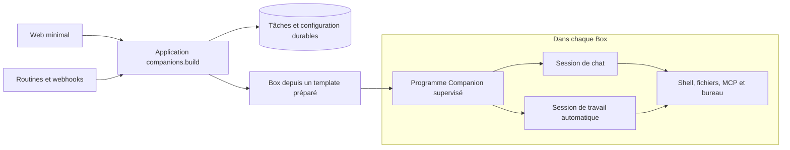

# companions.build — notre harness, quel moteur et quel binaire ?

Recherche du **5 septembre 2026**, conservée comme justification du choix.
**Suite de la discussion : Stan a retenu Pi/Bun.** Les comparaisons proposées ci-dessous ne sont
plus un préalable ; priorité à la validation du packaging et des comportements Pi/Bun.
Le [cadrage produit](../companions-build.md) fait référence pour les décisions à jour.

## Recommandation

Construire notre **programme Companion**, avec une interface petite et explicite, et commencer
avec **Pi SDK embarqué** pour le moteur. Viser une distribution autonome et figée construite
avec Bun, préinstallée dans un template Box. Valider ce packaging avant d'investir dans le
produit : le binaire officiel de Pi ne prouve pas que notre intégration SDK tient sans adaptation
dans un seul fichier.
L'installation autonome est un critère de passage du prototype, pas une finition à repousser.
Si elle impose un assemblage fragile, réévaluer le choix avant de développer les fonctionnalités.

Si un exécutable natif Go devient un objectif déterminant, le choix crédible est **Go + Fantasy
+ le SDK MCP officiel**, avec une couche de sessions et de contexte à notre charge. Rust est
possible, mais je ne le choisirais pas par défaut pour ce produit web, très dépendant des outils
et des échanges réseau, développé principalement avec des agents de coding.

Ce jugement privilégie la quantité de comportements difficiles que nous devons maintenir.
Il ne repose sur aucun benchmark comparatif réalisé sur Box. Pi n'est pas déclaré le meilleur
harness universel ; il est le premier candidat pour réduire le travail spécifique au démarrage
de ce projet. Un échec de packaging, d'isolation des sessions ou de reprise peut changer ce choix.

## Trois décisions à séparer

| Couche | Ce qu'elle prend en charge | Position proposée |
| --- | --- | --- |
| Produit et orchestration | Companion, tâches, routines, triggers, délégation, réplicats, templates, accès et usage | À nous : ce sont les comportements propres à companions.build |
| Harness d'exécution | Contexte envoyé au modèle, outils, sessions, interruption, compaction et événements | Embarquer un moteur existant dans notre programme ; remplacer une partie seulement si nécessaire |
| Distribution | Exécutable, ressources, dépendances des outils, service au démarrage, mises à jour | À nous : version exacte, artefact vérifiable, template préparé |

Écrire le petit programme qui relie le produit au moteur est utile même en gardant Pi.
Réimplémenter chaque protocole de modèle et toute la mécanique des longues conversations
est un investissement supplémentaire, qui demande une justification distincte.

## Les candidats réellement trouvés

### Vercel fx : un candidat natif réel, encore expérimental

`vercel-labs/fx` est bien le projet évoqué : harness et CLI en **Zig**, licence Apache-2.0.
Le README annonce un binaire de 7,8 MiB et qualifie explicitement le projet d'expérimental.
Cette taille annoncée ne mesure ni le démarrage d'un Companion ni sa mémoire en exécution.
Source : [README figé au commit étudié](https://github.com/vercel-labs/fx/blob/478960a8ab9315507e0a40d4434df71898fadf13/README.md).

Il faut distinguer deux intégrations :

- **CLI/ACP** : outils et sessions du produit fx, pilotage par JSON-RPC sur stdin/stdout.
  La documentation ACP décrit une session et un prompt actifs par connexion. Elle indique
  aussi que les images ne sont pas acceptées dans `session/prompt` sur cette surface.
  Pour chat et routine simultanés, il faut donc examiner plusieurs processus/connexions.
  Source : [ACP](https://fx.sh/docs/using-fx/acp).
- **libfx** : noyau natif N-API ou WebAssembly pour un hôte JavaScript. Le README du code
  courant expose `prompt`, `checkpoint`, `close`, les outils fournis par l'hôte et un adaptateur
  MCP. Le checkpoint est disponible à l'arrêt d'un prompt, pas pendant son exécution ; le
  stockage durable et le cycle de vie des clients MCP restent à l'hôte.
  Source : [SDK au même commit](https://github.com/vercel-labs/fx/blob/478960a8ab9315507e0a40d4434df71898fadf13/sdk/README.md).

Attention au décalage des sources : la [page Node SDK](https://fx.sh/docs/lib/node) décrit encore
une API de sessions différente et des outils absents. Le code consulté définit bien des outils
d'hôte et interdit `checkpoint()` pendant un prompt actif. Pour un prototype, fixer un commit
et vérifier le package réellement publié ; mélanger exemples de documentation et version
courante ferait partir l'intégration sur de mauvaises bases.
Source : [implémentation JavaScript](https://github.com/vercel-labs/fx/blob/478960a8ab9315507e0a40d4434df71898fadf13/sdk/fx-sdk.js).

L'API embarquée étudiée reste construite autour du Gateway Vercel ; le point d'entrée réseau
autorisé et la sélection de modèles doivent être vérifiés pour notre facturation centralisée.
Un binaire CLI autonome et une bibliothèque native pour JavaScript sont deux distributions
différentes. Embarquer libfx dans Go/Rust n'est pas le chemin documenté ci-dessus.

**Avis :** challenger intéressant pour un futur besoin mesuré de faible empreinte. Son état
expérimental et les écarts de documentation augmentent aujourd'hui le coût d'intégration.
Je ne commencerais pas par un fork Zig maintenu par notre équipe.

### Shopify : plusieurs systèmes, pas un binaire général à adopter

La recherche identifie plusieurs candidats ; le nom exact auquel Stan pensait reste inconnu.
**River/Aquifer** désigne une plateforme interne ; **Dispatch** un orchestrateur de sécurité ;
**Roast** un framework open source de workflows Ruby. Roast peut appeler Claude ou Pi : choisir
Roast n'élimine donc pas nécessairement le choix du harness sous-jacent.
Le code Roast examiné sélectionne même Pi par défaut.
Sources : [River/Aquifer](https://shopify.engineering/under-the-river),
[configuration Roast figée](https://github.com/Shopify/roast/blob/0cd5406ea02ac8f64b8b7a697270fd4d84a57b2c/lib/roast/cogs/agent/config.rb).
Voir l'[enquête Shopify](companions-build-shopify-harness-2026-09-05.md) pour Dispatch et les limites
d'identification.

La leçon de River/Aquifer est pertinente : distinguer infrastructure d'exécution, état durable
et moteur d'agent. Son architecture interne n'est pas un plan à recopier pour notre première
version. Aucun de ces trois noms ne constitue, dans les sources examinées, un remplacement
évident de Pi livré comme petit daemon général Go pour Box.

### Pi : réutiliser les sessions ou seulement la boucle

Pi expose trois niveaux : adaptateurs de modèles (`pi-ai`), boucle d'agent (`pi-agent-core`),
puis sessions/outils/compaction (`pi-coding-agent`). Le SDK complet permet notre propre surface
web et nos outils. Descendre à `pi-agent-core` réduit le socle repris mais nous rend propriétaires
de davantage de gestion du contexte et de persistance.
Sources et détail des responsabilités : [enquête native et Pi](companions-build-native-harness-2026-09-05.md).

Le SDK v0.85.0 documente historique, compaction, événements, interruption et remplacement de
session. `createAgentSessionRuntime()` remplace sa session active ; ce n'est pas à lui seul un
ordonnanceur de conversations concurrentes. Chat et routine demandent des instances distinctes.
L'acceptation d'un prompt et la fin de son travail sont aussi deux moments distincts.
Source : [SDK v0.85.0](https://github.com/earendil-works/pi/blob/v0.85.0/packages/coding-agent/docs/sdk.md).

**Avis :** bon premier choix d'intégration. Configurer explicitement les ressources et outils
nécessaires ; ne pas reconstruire l'ancien assemblage de scripts, extensions installées au
réveil, broker RPC et multiples voies de réparation. Les outils MCP et notre MCP de contrôle
doivent être intégrés et testés comme capacités du programme Companion.

### OpenCode : beaucoup de fonctions disponibles, davantage de produit à intégrer

OpenCode fournit un serveur HTTP, des sessions, le streaming d'événements, des actions
asynchrones et l'annulation. Il offre également MCP et plugins. Cela réduit le travail si
l'on veut piloter un agent de coding déjà constitué.
Sources : [serveur](https://opencode.ai/docs/server/),
[MCP](https://opencode.ai/docs/mcp-servers/), [plugins](https://opencode.ai/docs/plugins/).

La persistance des sessions et un flux SSE ne suffisent pas à établir une garantie de reprise
de tâche après perte d'accusé de réception. Il faut la vérifier dans l'intégration. Son serveur
introduit aussi une frontière de processus/API supplémentaire si notre programme le supervise.

**Avis :** utile comme comparaison de qualité fonctionnelle ; moins naturel qu'une bibliothèque
embarquée pour construire une surface Companion étroite. Ne pas confondre ce coût d'intégration
avec une preuve qu'OpenCode serait lent ou instable : cette recherche n'en apporte pas.

### Vercel AI SDK, Fantasy et Rig : des briques pour construire notre moteur

L'AI SDK TypeScript fournit une boucle d'outils ; son API de harnesses permet aussi de piloter
des moteurs existants. Ce sont des niveaux différents. Ajouter un adaptateur de harness au-dessus
de Pi n'enlève pas Pi et ajoute une dépendance au contrat d'adaptation.
Source : [AI SDK 7](https://vercel.com/blog/ai-sdk-7).

**Fantasy** est l'option Go à examiner pour réutiliser les adaptateurs de modèles et la boucle
d'outils. **Rig** est une option Rust, dont les capacités de pilotage explicite ont évolué :
ne pas l'évaluer sur des descriptions anciennes. Les deux demandent de vérifier précisément
ce qu'ils fournissent pour les sessions durables et la compaction au lieu d'assimiler une boucle
à un Companion complet. **Goose** est un agent Rust plus complet, à évaluer séparément d'une
bibliothèque minimale. Détail, licences et références figées dans l'[enquête native](companions-build-native-harness-2026-09-05.md).

## Go, Rust ou TypeScript compilé ?

| Option | Pour companions.build | Contre / travail restant | Mon choix |
| --- | --- | --- | --- |
| TypeScript + Pi SDK + Bun | Même langage que le web ; sessions et contexte réutilisés ; distribution autonome envisageable | Runtime JS embarqué ; assets/imports dynamiques à éprouver ; MCP à intégrer ; empreinte à mesurer | Premier candidat pour livrer un produit simple |
| Go + Fantasy + SDK MCP | Exécutable natif ; APIs explicites ; outils Go de tests, profiling et concurrence | Deux langages avec le web ; sessions, compaction et reprise à concevoir ; compatibilité modèle à tester | Premier choix si l'on construit un moteur natif maison |
| Rust + Rig + SDK MCP | Exécutable natif ; types et ownership imposent des garanties utiles | Charge d'async/traits/ownership ; intégration et contexte toujours à nous | À retenir si expertise Rust ou contrainte mémoire démontrée |
| Zig + fork fx | Base native petite et déjà agentique | Suivre un projet expérimental et maintenir un langage supplémentaire | Pas le choix initial proposé |

Les préférences de maintenance ci-dessus sont un jugement pour ce projet, pas un classement
mesuré de la qualité du code généré par les LLM selon le langage. Nous n'avons pas conduit une
évaluation comparative de vibe coding.

Go inclut son runtime dans ses exécutables usuels ; cgo et les bibliothèques système choisies
peuvent changer les conditions de distribution. Le langage ne supprime pas les races : son
détecteur les recherche lors de l'exécution des tests. Rust vérifie ownership et emprunts,
mais ne prouve pas qu'un webhook ne sera jamais perdu ou qu'une action distante ne sera pas
dupliquée. Sources : [FAQ Go](https://go.dev/doc/faq#Why_is_my_trivial_program_such_a_large_binary),
[race detector](https://go.dev/doc/articles/race_detector),
[ownership Rust](https://doc.rust-lang.org/book/ch04-01-what-is-ownership.html).

Bun peut produire un exécutable contenant le runtime et le code TypeScript/JavaScript ; les
workers et ressources doivent être inclus correctement. C'est une possibilité de packaging,
pas la preuve qu'une dépendance quelconque se compile sans travail.
Source : [exécutables Bun](https://bun.com/docs/bundler/executables).

## Ce que coûte vraiment un harness maison

| Responsabilité | Ce qu'il faut savoir vérifier |
| --- | --- |
| Modèles | Streaming incomplet, JSON d'outil tronqué, images, raisonnement, usage et erreurs propres aux fournisseurs |
| Outils | Validation avant effet, sorties volumineuses, délais, annulation effective des processus, résultats tardifs |
| Conversations longues | Compaction sans casser les paires appel/résultat ; récupération du contexte ; conservation du transcript |
| Persistance | Écriture avant exécution ; relecture après crash ; compatibilité des sessions entre versions |
| Reprise | Distinguer travail non commencé, travail terminé et effet externe dont l'issue est inconnue |
| Interventions | Demande d'aide humaine, autorisation, message pendant le travail et annulation |
| Intégrations | MCP local/distant, authentification, reconnect, outils indisponibles et évolution des schémas |

Réutiliser une bibliothèque externalise une partie de ce travail, jamais l'intégration entière.
Le bénéfice du moteur maison serait un contrat exactement adapté à nos sessions, outils et
événements, avec peu de fonctionnalités inutilisées. Le coût est de posséder ces cas limites
et de suivre les changements des fournisseurs. Une petite démonstration « modèle → outil →
modèle » ne permet pas d'estimer la taille du système fiable.

Pour le vibe coding, garder des états explicites, des frontières lisibles et des tests de panne
observables est plus utile que promettre une limite arbitraire de lignes. Un compilateur peut
réduire certaines erreurs ; il ne remplace pas les tests des promesses produit.

## Solution concrète proposée

Le diagramme exprime des responsabilités, pas une demande de microservices. Le point de départ
peut rester une application avec son exécution de fond, une base et un programme dans les Boxes.

1. Construire le programme une fois, avec dépendances et ressources figées. Publier un artefact
   versionné et vérifiable, puis l'installer dans le template avec son service de démarrage.
2. Créer/réveiller une Box sans installation réseau du runtime. Sa disponibilité permet ensuite
   au programme d'accepter des tâches identifiées et d'en publier l'activité et l'issue.
3. Utiliser Pi dans le programme comme bibliothèque. Commencer par un moteur réel unique,
   derrière quelques opérations compréhensibles ; ne pas bâtir une plateforme multi-harness.
4. Garder chat et travail automatique dans des sessions distinctes. Cette séparation ne règle
   pas les collisions sur le même fichier ou bureau : tester l'intervention humaine et les
   ressources partagées explicitement. L'affectation exacte des triggers/délégations reste un
   choix produit ouvert.
5. Exposer la configuration et les délégations par le MCP companions.build. Les réplicats sont
   des tâches/Boxes du produit ; le mécanisme local de subagents d'un moteur n'est pas leur
   propriétaire. Une promotion de template est aussi une opération du produit.
6. Garder les tâches et résultats visibles après fermeture du web ou arrêt du moteur. Au crash,
   rendre visible un effet ambigu au lieu de rejouer aveuglément toute la tâche. Une session
   relisible n'est pas une preuve d'exécution exactement une fois.

Répartition proposée de l'autorité : la base de l'application conserve l'acceptation des tâches,
leur état, leurs résultats et l'activité nécessaire à leur affichage. La session du moteur
conserve le contexte du modèle ; elle ne décide pas seule du statut de la tâche produit.
Le programme dans Box remet les événements à l'application avec des identifiants permettant
leur déduplication. Un accusé de réception perdu demande de relire l'état de la même tâche.
Si son effet reste inconnu après un crash, le marquer interrompu puis libérer la session pour
le travail suivant ; ne pas relancer cet effet automatiquement. Le protocole exact d'écriture
et de remise des événements reste à spécifier et à tester : l'embarquement de Pi ne l'élimine pas.

Un exécutable ne contient pas forcément les serveurs MCP arbitraires, Chromium, Git, Python et
tous les logiciels qu'un utilisateur installera. Les outils prévus font partie du template ;
les installations demandées ensuite sont des opérations explicites. Aucune raison de les
réinstaller à chaque réveil.

Box documente précisément les templates préparés et le redémarrage des services systemd après
restauration ; les processus et leur mémoire ne survivent pas. Les temps « quelques secondes »
du fournisseur restent à mesurer avec notre image, nos sessions et nos outils.
Source : [snapshots Box](https://docs.ascii.dev/box/snapshots).

## Expérience de décision avant construction du produit

Faire d'abord une vérification courte de distribution et de pilotage pour **Pi SDK/Bun**,
**Go/Fantasy** et **fx natif**. Inclure lancement hors du dépôt, outils explicites, deux sessions
et arrêt ; relever aussi le temps d'intégration et le code spécifique requis. L'état expérimental
de fx ne dispense pas de soumettre notre propre packaging Pi au même niveau d'exigence.

Puis retenir au maximum deux candidats pour les comportements complets ci-dessous, sur le même
type de Box, le même modèle, les mêmes tâches et outils. Comparer leur coût total d'intégration :
le travail de contexte supplémentaire de Go doit être compté, ainsi que les adaptations nécessaires
à Pi ou fx. L'objectif est de choisir un socle, pas de construire trois moteurs en parallèle.

| Essai | Ce qui fait réussir l'essai |
| --- | --- |
| Distribution propre | Sur Linux cible sans environnement de développement, le programme démarre avec les seuls fichiers annoncés et sans installer ses dépendances |
| Création et réveil | Mesurer séparément Box demandée → prête, lancement → agent prêt, prompt → premier token ; publier médiane et p95 sur essais répétés |
| Vrai travail | Fichier à lire/modifier, commande à lancer, outil MCP texte/image, usage remonté ; résultat vérifié indépendamment |
| Concurrence | Une routine longue n'empêche pas le chat de répondre ; annuler une session laisse l'autre fonctionner |
| Crash | Couper avant/après un effet d'outil et une écriture durable ; aucune tâche acceptée perdue, aucun effet ambigu rejoué automatiquement |
| Contexte long | Forcer la compaction puis redémarrer ; les décisions essentielles et l'historique restent utilisables |
| Réseau | Déconnecter l'observateur et un MCP ; reconnexion et résultat final cohérents |
| Template enfant | Travail terminé puis snapshot ; l'enfant suivant retrouve le logiciel voulu avec une nouvelle identité d'exécution |

Le seuil déjà discuté est moins de deux secondes pour l'agent prêt après lancement sur une Box
disponible. Mesurer aussi mémoire au repos/pendant deux sessions, taille réellement distribuée,
fichiers ouverts et temps passé dans les imports, la découverte des outils et le modèle.
Les journaux et checkpoints doivent rester consultables indépendamment du moteur.

Si Pi respecte ces promesses, garder cette solution et investir dans le produit. Si le SDK
impose une adaptation lourde, un chargement fragile ou un coût mesuré inacceptable, Go devient
une alternative justifiée. Rust demande une motivation supplémentaire liée aux contraintes
réelles ou à l'expertise de maintenance.

## Limites de cette recherche

Lecture de documentations officielles, manifests et code source. Aucune campagne de performance,
de reprise complète ou de qualité de tâche sur Box n'a été menée. Les données de benchmarks
publiées par les projets ne sont pas utilisées pour annoncer les performances de companions.build.
Les essais proposés ne sont pas une implémentation commencée ni une décision technique validée.

Pour les sources détaillées par branche : [Shopify](companions-build-shopify-harness-2026-09-05.md)
et [Go/Rust/Pi/OpenCode](companions-build-native-harness-2026-09-05.md).
