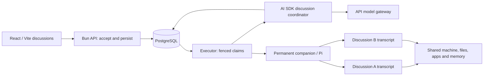

# Discussions and companions

Approved by Stan on 11 September 2026. Delivery: THE-637. This supersedes the single
principal conversation, specialist, routine and trigger portions of the older v0 scope.

Discussions are independent histories, optionally organized in folders. Folders supply
authorized companions, not shared context. A central AI SDK agent on the Bun executor
coordinates permanent Pi companions. It has no computer tools or memory across discussions.
Each companion keeps its machine, connections and memory; each discussion has a distinct Pi
session on that machine. Direct discussions select that companion without a coordinator.

Explicit mentions authorize and address a companion for that message. The composer can also
select a persistent recipient. Other invitations require user acceptance unless the folder
already authorizes the companion. A removed companion cannot receive new work, but accepted
work continues and its messages, files and workbench remain visible. Closing or archiving a
discussion does not cancel work. Stop chat and stop companion are separate controls.

An arriving companion gets a bounded context briefing and can retrieve the discussion's
history through a scoped control tool. Work and artifacts are scoped to the discussion;
reuse elsewhere requires explicit references. Workbench tabs follow actual companion
capabilities; profiles from separate Design PRs are not silently invented or merged here.

## HTTP contract

All routes require the authenticated account and enforce ownership. JSON errors have
`error`. Writes use same-origin protection. Identifiers are UUIDs; timestamps are ISO strings.
The API only persists admission; the executor owns model and companion execution.

- `GET /api/discussions?archived=true` -> `{discussions, folders}` (default excludes archived).
- `POST /api/discussions` `{clientCreationId,title?,folderId?,directCompanionId?}` -> `{discussion}`.
- `GET /api/discussions/:id?before=<message-sequence>` -> snapshot described below; last 50
  messages, older pages exclusive, ascending. Poll the current page to follow persisted work.
- `PATCH /api/discussions/:id` `{title?,folderId?:string|null,archived?:boolean}` -> `{discussion}`.
- `GET /api/companions/:id/discussions` -> `{discussions}`; new direct discussions use the
  general creation route with `directCompanionId`.
- `POST /api/discussion-folders` `{clientCreationId,name,companionIds}` -> `{folder}`.
- `PATCH /api/discussion-folders/:id` `{name?,companionIds?}` -> `{folder}`.
- `DELETE /api/discussion-folders/:id` -> `{ok:true}`; discussions become ungrouped.
- `PUT /api/discussions/:id/participants/:companionId` -> `{ok:true}`; explicit invitation.
- `DELETE /api/discussions/:id/participants/:companionId` -> `{ok:true}`; no cancellation.
- `POST /api/discussions/:id/messages`
  `{clientMessageId,content,targetCompanionId?:string|null,attachmentCount?:number}` ->
  `{runId,discussionId,companionId:string|null}`. A target is an explicit mention/selection
  and is durably invited. Omitted target addresses the central agent, or the direct companion
  for a direct discussion. At most five 10 MiB files. Retry the same ID/body after uncertainty.
- `POST /api/discussions/:id/runs/:runId/files` multipart `file,clientFileId,position` -> `{file}`.
- `POST /api/discussions/:id/cancel` -> `{ok:true}`; stops central chat, or direct companion chat
  in a direct discussion, without stopping work in other discussions.
- `POST /api/discussions/:id/participants/:companionId/cancel` -> `{ok:true}`; stops this
  companion's work in this discussion, not the entire machine or other discussions.
- `POST /api/discussions/:id/questions/:questionId/answer` `{answer}` -> `{ok:true}`.
- `POST /api/discussions/:id/proposals/:proposalId` `{accept:boolean}` -> `{ok:true}`;
  accepts/declines an invitation. Acceptance only authorizes; the executor continues afterward.

`Discussion`: `id,title,folderId,directCompanionId,archivedAt,createdAt,updatedAt`.
`Folder`: `id,name,companionIds,createdAt`.
Snapshot: `{discussion,participants,messages,tasks,centralRuns,proposals,beforeCursor}`.

- Participant: `{companionId,removedAt,companion}`; `companion` has the existing Companion shape.
- Message: `{id,sequence,role,content,companionId,runId,createdAt,complete,files}`;
  `sequence` is a decimal string, so large history cursors retain their precision.
  nullable companion identifies central replies; user messages retain their intended target.
- Task: `{id,companionId,status,content,previewText,resultText,error,createdAt,finishedAt,questions,files}`.
- Question: `{id,question,options,answer}`.
- Central run: `{id,status,previewText,error,createdAt,finishedAt}`.
- Proposal: `{id,companionId,reason,prompt,status}`; status `pending|accepted|declined`.
- Files follow existing `ThreadFile`: `{id,runId,kind,name,mimeType,size,url}`.

## Recovery, removal and deployment

Persist stable message/task IDs before effects. Never replay an ambiguous model/tool or agent
execution. PostgreSQL owns browser state; Pi owns companion transcripts. Claims and results
are fenced by executor leadership, account ownership, discussion identity and response root.
Central usage is recorded from server-observed model usage independently of companion usage.

Delete specialist/routine/trigger features and their associated records, rather than keeping
an archive UI. Deployment must stop old admissions/executors, reconcile and archive owned
temporary machines, purge retired-feature records and files, then start the rebuilt release.
Permanent companions and unrelated machines must survive. Follow the [deployment procedure](../discussions-migration.md). Rollback requires a pre-migration
backup after destructive cleanup; old binaries must never run against the new schema.

The desktop takeover concurrency extension is deferred. `pi-background-tasks` is a candidate
for local companion commands only, pending Pi/Bun and provider compatibility; it is not a
dependency of central delegation. No additional companion type is part of this change.

## Execution boundaries

Central model calls use a short-lived token bound to the accepted turn, its owner and the
executor's PostgreSQL leadership. Provider credentials remain inside the API gateway; measured
usage is attached to the central turn without allocating a companion or computer. Model retries
are disabled. An interrupted central call remains interrupted and requires a new user message.

Delegation tools atomically record their call identity and the accepted task or invitation.
A companion's terminal result creates at most one coordinator continuation. Directly addressed
companion results stay in the discussion without an unsolicited coordinator turn. A removed
participant's accepted task can still finish. Attachment references are checked before bytes are staged on the destination machine.
Cross-discussion reuse requires the user to paste the exact file ID or download link in a user
message; the source must belong to the same account. An assistant suggestion cannot grant
this access. The coordinator can retrieve only that referenced file, without the other history.

Context is bounded; full history stays in PostgreSQL and is available through a discussion-scoped
history tool. Folder membership supplies no other conversation's messages. The arrival briefing
and independent Pi directory are separate from each companion's shared durable memory.
